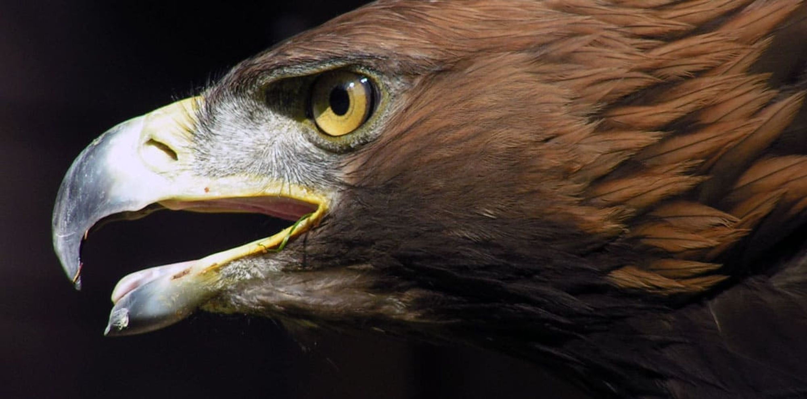

<h1>Feather Vision</h1>

<h2>Project description </h3>

Ornithology enthusiasts and zoologists are people we thank for protecting and discovering new species on almost daily basis. Their jobs are already extremely difficult with the amount of information they have to keep track of while always being on the lookout for rare sightings of exotic birds.
With FeatherVision their job will be made much easier, when it comes to identifying numerous different species of birds.

The objective of our project is to create a machine learning model capable of accurately classifying bird species based on visual attributes in images. This way anyone could become a beginner ornithologist by simply capturing an image of their own and finding out the details of the fauna in their local area. And for those advanced in the field, they could spend more time taking care of endangered species and researching by decreasing the precious time needed to properly identify these species.
 

 The world of birds is enormous and with FeatherVision you will never get lost in it again!  

<h2>Business Objectve Definition</h3>

We believe that our solution will help in multiple branches. First of all, as mentioned above,  ornithology would gain an easy to use tool for identifying bird species, which means that everyone could track the different species in their local area. Our solution could also serve for everyday use for people who's hobby it is to observe different bird species in their local are or when on vacation.

Our goal is to be able to identify bird species by just looking at them. You simply take a picture of the bird and our trained model will tell you what kind of bird this is. Since our dataset is fully labeled, meaning all the pictures have a label (bird species name) that the model can check, we chose the <b>Supervised Learning</b> approach. This means we will most likely choose a classification model to classify an image to a species' name.

<h2>Performance Metrics</h3>

We've chosen accuracy as our main performance metric. Accuracy measures the proportion of correctly classified instances out of all instance.

We don't see any specific benefit in focusing on either precision or recall, which might be the case if we wanted to ensure a rare bird species is correctly identified (high recall) or to minimize missclasification among species (high precision).
To complement accuracy and gain deeper insights into our model's performance across different species, we'll also utilize a confusion matrix. This approach will help us identify how well the model differentiates between species and highlight areas for improvement.

---

<h2>Data exploration</h2>

We have decided to use birds classification dataset from <a href="https://www.kaggle.com/datasets/gpiosenka/100-bird-species">kaggle</a>. It contains 525 bird species, 84635 training images, 2625 test images, and 2625 validation images (5 images per species for both test and validation). The author of the dataset notes that the 'best' pictures were chosen for the test and validation data sets, so we might achieve slightly worse results if we split the data ourselves. This is not an issue, since we want to use the model on our own images anyway.
<h3>Notes on the dataset</h3>
<ul>
<li>All the images are photographed and not AI generated.</li>
<li>Each picture contains only one bird.</li>
<li>In most pictures, the pixels of the bird take up at least 50% of the image.</li>
<li>Around 80% of the images show male birds, which are typically much more colorful than females. This means that the model will perform considerably worse on female birds, especially if they look different from males.</li>
</ul>

<h3>Size and type of data</h3>

As mentioned earlier, the dataset contains almost 85K good quality images.   
<ul>
	<li>The images are sized 224 X 224 x 3 color channels (RGB) making them suitable as input to convoluted neural networks.</li>
	<li>The images are in JPG format.</li>
	<li>The average image size is around 20kB.</li>
	<li>The images are photographed during all seasons and it should contain species from every continent.</li>
</ul>

---

<h2>Conclusion</h2>

In summary, we are satisfied with the project and the results it yielded. Our approach was incremental as we found better ways to approach the problem in the course of the development. After introducing the problem and exploring the data, the first shortlisted model was Support Vector Machine trained on the pixel distribution data of the bird pictures. This method was quickly abandoned, since the results were poor with 
  
- Train Accuracy of 0.323 
- Test Accuracy 0.171

pixel distribution does not hold enough information for the model in this application.

Switching to Image2Vector library for extracting image information and training the SVM model on the vectors, the model performance skyrocketed to 
  
  - Train Accuracy: 0.993
  - Test Accuracy: 0.951 
  - Test Precision: 0.954 
  - Test Recall: 0.951
  
which was very surprising as we expected that only a convoluted neural network would be able to deliver such results.

The neural network proved to be very computationally demanding, as training it without a pre-trained model on only a small subset of the original dataset took more than 3 hours. As the Image2Vector proved to be an effective tool, the image vectors were used as an input to the second version of the neural network and this resulted in our best model with 

- Validation Accuracy: 0.887
- Test accuracy: 0.910
  
This performance is slightly worse than the SVM with feature vectors, but offers the versatility of the neural network and allows us to train the model on the large original dataset in about 90 seconds.

We set our goal to be using our own pictures and recognizing the bird species using our models, which we successfully showcase in the last steps and it concludes our project.

